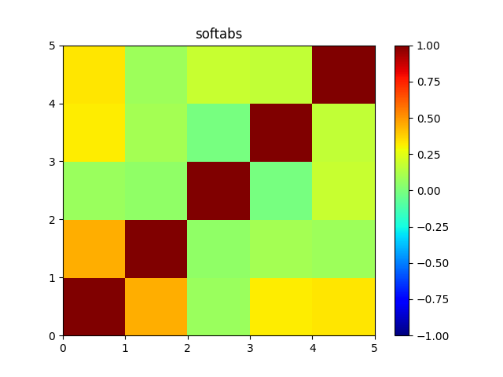
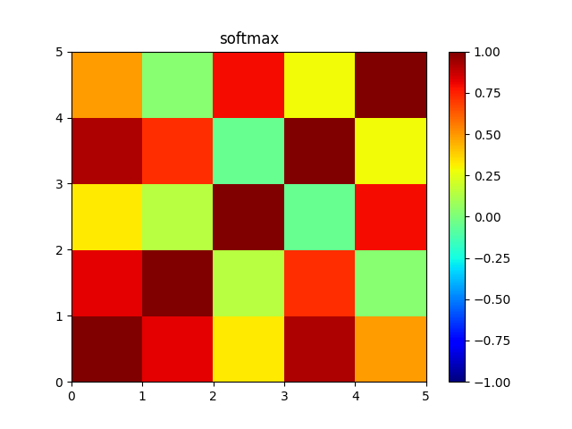

## CS295 Final Project - High-Dimensional Memory Augmented Neural Networks

In this project, we attempt to reproduce the results from Robust high-dimensional memory-augmented neural networks[1].  In this project, we are using the omniglot dataset[2] of size 32x32 in greyscale as our evaluation model. The Omniglot dataset is the most popular benchmark for few-shot image classification. All the experiments in this project are conducted using the **5-way 1-shot** classification problem due to limitations in computation resources. The code for our project can be found at https://github.com/DailinH/HD-MANN.

### 1. MANN Architecture with the binary-key memory using analog in-memory computations

For the classification task, we are using CNN as a controller for the HD-MANN architecture. The CNN constitutes of 2 convolutional layers each with 128 filters of shape 5x5 and dilation 2, a max-pooling with a 2x2 filter of stride 2, another 2 convlutional layers each with 128 filters of shape 3x3, another max-pooling layer with 2x2 filter of stride 2 and a fully connected layer with d units. Each convolutional layer uses ReLU activation. The embedding function is of non-linear mapping

$$
f: B^{32\times 32} \rightarrow R^d.
$$

The structure of the CNN controller can be described in graph as


We define the CNNController class as

```python
class CNNController(nn.Module):
    def __init__(self, d):
        super(CNNController, self).__init__()
        self.block1 = nn.Sequential(nn.Conv2d(1, 128, 5,dilation=2),nn.ReLU(),nn.Conv2d(128, 128, 5,dilation=2),nn.ReLU())
        self.maxpool1 = nn.MaxPool2d(2, stride=2)
        self.block2 = nn.Sequential(nn.Conv2d(128, 128, 3),nn.ReLU(),nn.Conv2d(128, 128, 3),nn.ReLU())
        self.maxpool2 = nn.MaxPool2d(2, stride=2)
        self.fc = nn.Linear(512, d)

    def forward(self, inputs):
        x = self.block1(inputs)
        x = self.maxpool1(x)
        x = self.block2(x)
        x = self.maxpool2(x)
        x = torch.flatten(x,start_dim=1)
        return self.fc(x)
```

Input data will be mapped into HD space with d dimensions through the controller so it can be treated as a HD encoder. For both training and validation, a support set and a query set will be provided to the controller. The goal is to let the controller map objects in the same category to simliar location in HD space for both sets. 

After the support set is mapped into HD vectors, they will be saved into external memory for comparing with the query set HD vectors. We calculate the cosine similarity between each query set HD vector and all support set HD vectors, apply shapening and normalization. Finally, we dot product the similarity matrix with the ground truth labels to get a weighted sum as our prediction.


### 2. Attention Mechansim for the Key-Value Memory

Let $\alpha$ be the consine similarity and $\epsilon$ the sharpening function. The attention function $\sigma$ is defined as

$$
\sigma(q, K_i) = \frac{\epsilon (\alpha (q, K_i))}{\sum_{j=1^{mn}} \epsilon (\alpha (q, K_j))}.
$$

The sharpening function is a soft absolute(softabs) function proposed in the paper

$$
\epsilon(\alpha) = \frac{1}{1 + e^{-(\beta(\alpha-0.5))}} + \frac{1}{1 + e^{-(\beta(-\alpha-0.5))}}
$$

where $\beta = 10$ is a stiffness parameter.

The purupose of the sharpening function is to have uncorrelated vectors of different classes as they would have randomly drawn from the HD space to robustly represent items.

The learned representations by softabs bering the support vectors of the same class close together in the Hd space, whie pushing the support vectors of different classes apart.

 


### 3. Comparison between Bipolar Key Memory and Binary Key Memory

During training phase, the real-valued vectors are written to key-memory. During the inference phase, the support vector generated by the controller can be clipped by applying a sign function for bipolar representations. Bipolar vectors with the same dimensionality d always have the same norm of $||\hat{\hat x}|| = \sqrt d$. This simplifies the cosine similarity calculation to
$$
\alpha (\hat{\hat a},\hat{\hat b} ) = \frac{1}{d} \hat{\hat a}\cdot \hat{\hat b}^T
$$
and the normalization in the consine similarity can be removed.

To simplify the representation even more, we transform the bipolar vectors into binary vectors by
$$
\hat{x} = \frac{1}{2}(\hat{\hat x}  + 1).
$$
Suppose that the bipolar vector has a near equal number of +1 and -1, the binary vector would have a norm of $||x|| \approx \sqrt{\frac{d}{2}}$. The cosine similarity can be transformed into 
$$
\alpha (\hat{ a},\hat{ b} ) \approx \frac{2}{d} \hat{ a}\cdot \hat{ b}^T \approx \frac{1}{2}(\alpha (\hat{\hat a},\hat{\hat b} ) + 1)
$$
comparing the bipolar and binary vector representations on 5 way 1 shot omniglot classification, we plot the following graphs:


This doesn't show a significant difference between the two methods, the reason is likely to be that 5 way 1 shot is too small a problem in scale to show a fundamental difference. This corresponds to the result shown in the original paper.

##### References:

[1] Karunaratne, Geethan, et al. "Robust high-dimensional memory-augmented neural networks." Nature communications 12.1 (2021): 1-12.

[2] Lake, Brenden M., Ruslan Salakhutdinov, and Joshua B. Tenenbaum. "The Omniglot challenge: a 3-year progress report." *Current Opinion in Behavioral Sciences* 29 (2019): 97-104.
